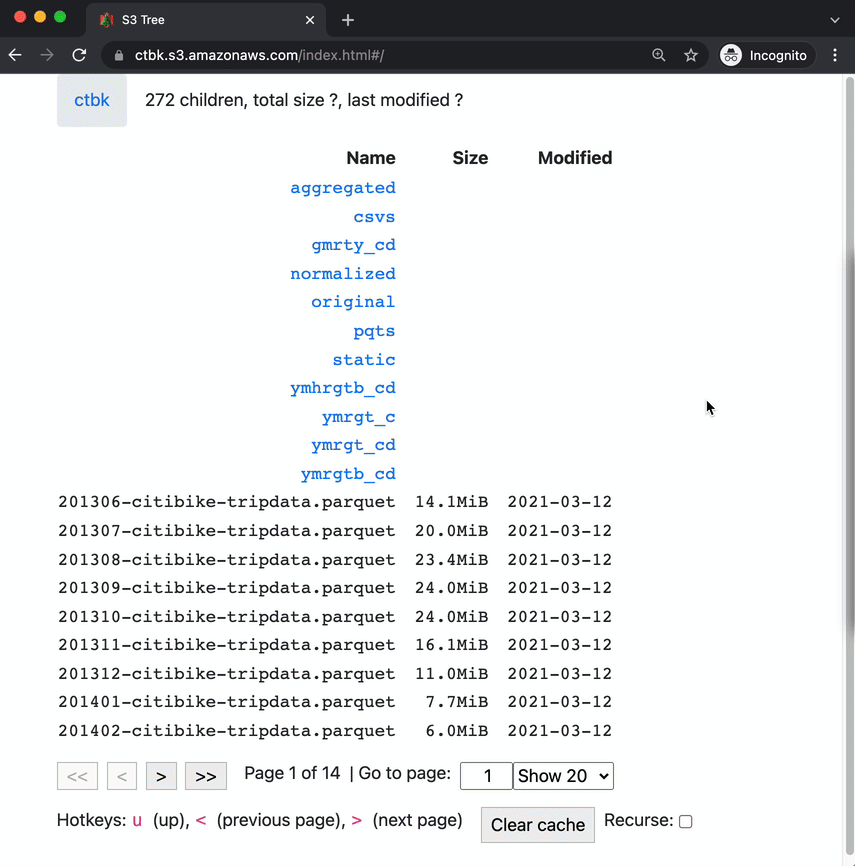

# s3idx 
Amazon S3 bucket browser in a single `index.html` file

- [Usage](#usage)
- [Examples](#examples)
- [Implementation Notes](#implementation)
  - [Caching](#caching)
  - [Configuration](#configuration)
  - [Upload args](#upload-args)
  - [Local development](#local-development)
  - [S3 websites](#s3-websites)
- [Security](#security)
- [Roadmap](#roadmap)

## Usage <a id="usage"></a>
Copy `s3://s3idx/index.html` to any public S3 bucket:
```bash
aws s3 cp s3://s3idx/index.html s3://$bucket/ \
  --content-type="text/html; charset=utf-8" \
  --acl public-read
```

Browse `$bucket` interactively:
```bash
open https://$bucket.s3.amazonaws.com/index.html
```

## Examples <a id="examples"></a>
Here's `index.html` in action in the `ctbk` bucket, [ctbk.s3.amazonaws.com/index.html](https://ctbk.s3.amazonaws.com/index.html):



Note:
- paginated results
- caching/pre-fetching for snappy responses
- opt-in recursive fetching
- total sizes / last modified times for directories (only when fully fetched)

## Implementation Notes <a id="implementation"></a>

### Caching <a id="caching"></a>
- Requests to S3 (`ListObjectsV2`) are cached for a configurable length of time (default: 10hrs)
- "Recurse" checkbox (default: off) toggles fetching bucket/directory contents recursively (vs. just the immediate children of the current directory)
- Changes to above settings (as well as others, e.g. size and datetime formats) are persisted in `localStorage`

### Configuration <a id="configuration"></a>
Various global defaults can be initialized on a per-bucket basis, in the deployed `index.html`, by modifying these values at the top of the file:
```html
<!doctype html><head><title>s3idx</title><script>// ****** s3idx config ******
        // Global default config; uncomment/change lines as desired.
        // Used to seed localStorage values (that then take precedence)
        var S3IDX_CONFIG = {
            // datetimeFmt: "YYYY-MM-DD HH:mm:ss",
            // sizeFmt: "iso",
            // eagerMetadata: false,
            // ttl: "10h",
            // pageSize: 20,
            // s3PageSize: 1000,
            // paginationInfoInURL: true,
            // region: undefined,
        }</script>
…
```

There's probably a better way to do this, but for now, you can just edit `index.html` in a text-editor to uncomment/change the lines you want to change, or do something hacky like:
```bash
aws cp s3://s3idx/index.html ./
perl -pe -i 's/ttl: "10h"/ttl: "1h"/'
aws cp ./index.html s3://s3idx/ \
  --content-type="text/html; charset=utf-8" \
  --acl public-read \
  --cache-control max-age=3600,public
```

### Upload args <a id="upload-args"></a>
The trailing arguments above are necessary to make sure `index.html` is:
- public
- served as UTF-8 (it contains non-ASCII characters and will error otherwise, usually stuck with a page that says "Loadingæ")
- cached at a reasonable frequency
  - 1 hour, in this example
  - this caching is at the HTTP level, orthogonal to the app's `localStorage`-caching of data it receives from S3 (cf. [above](#caching))

### Local development <a id="local-development"></a>
Build in one terminal (and watch for changes):
```bash
npm run dev
```
Serve from `dist/` directory:
```bash
cd dist
http-server
```
Open in browser:
```bash
open http://127.0.0.1:8080/#/$bucket
```

Only buckets that set appropriate CORS headers will be usable; others will show an error page with info/suggestions. See also [discussion of CORS nuances in the Security section](#security).

### S3 websites <a id="s3-websites"></a>
`s3idx` should work from [S3 buckets configured to serve as static sites](https://docs.aws.amazon.com/AmazonS3/latest/userguide/WebsiteEndpoints.html), e.g. [`http://s3idx.s3-website-us-east-1.amazonaws.com/`](http://s3idx.s3-website-us-east-1.amazonaws.com/). However, I'm not sure there are any advantages to using it that way, as opposed to on the `s3.amazonaws.com` REST API subdomain (where your browser is happy to render it as `text/html`). 

### `Fetcher`
See [`src/fetcher.tsx`](src/s3/fetcher.tsx); each `Fetcher` handles interfacing with a specific "directory" (bucket or "prefix") on S3, fetching pages and maintaining a cache in `localStorage`, computing various summary statistics (number of children, total size, last modified time), and firing callbacks when they change.

It's pretty messy and imperative; lots of room for improvement. In particular, a [SQL.js](https://sql.js.org/#/) backend is appealing, especially for desired table-sorting/searching functionality.

## Security <a id="security"></a>
Below is an informal analysis of s3idx's security assumptions and properties.

### tl;dr
- Use on **public buckets** is believed to be secure / low-risk
- For use on **private buckets**, ["Local development"](#local-development) above shows how to run s3idx locally and point it at any bucket. The app will prompt for authentication or recommend CORS tweaks as necessary.
- Deploying directly to **private buckets** (s3idx's `index.html` still has to be public) is believed to be secure, by me, but I'm not 100% positive, and I am not a security engineer. **DEPLOY TO PRIVATE BUCKETS AT YOUR OWN RISK!**

Other details:
- Access/Secret keys (for using s3idx on private buckets) are submitted by the user and persisted in `localStorage`.
- `index.html` bundles everything it uses, and makes no requests to any external domains (even the favicon, and any images, are either emojis or base64-encoded).

### Public "bucket-subdomain" endpoint <a id="public-buckets"></a>
In the simple case, `index.html` is deployed to a public bucket and accessed at `<bucket>.s3.amazonaws.com/index.html`. It only makes HEAD and GET requests to that domain (when it doesn't have a cached version to fall back on).

### Private buckets
Lots more discussion follows, but ["Local development"](#local-development) above shows how to run s3idx locally and point it at any bucket. The app will prompt for authentication or recommend CORS tweaks as necessary.

s3idx can also be used in private buckets by:
- deploying `index.html` as a publicly readable object (cf. see `--acl public-read` in the installation commands)
- when a person visits it, it will call `listObjectsV2` to read the bucket's contents, receive an HTTP 403 error code (`AccessDenied`), and present the user with a form soliciting a "region" for the bucket as well as an access/secret key pair
- credentials are persisted in `localStorage`, so the user will be able to browse that bucket thereafter.

This increases the vulnerability surface in two important ways:
1. Credentials (access/secret key pair) are stored in `localStorage`.
2. A public `index.html` exists under `<bucket>.s3.amazonaws.com`

To mitigate 1., keys should always be scoped to "read" actions (`Get*`, `List*`) on the current bucket. 2. doesn't directly make any private data public, but it makes it easier for an attacker to access the user's keys (e.g. in the presence of overly permissive CORS headers).  

### CORS <a id="cors"></a>
The most likely security issue I can see results from overly permissive CORS headers on a private bucket with a public s3idx `index.html`.

The degree of over-permissioning required still seems quite high:
- wildcard origin (❗️)
- include credentials (‼️)

Such a CORS configuration on private or sensitive data seems to represent a serious security rsk on its own, independent of s3idx, it's possible I've missed some CORS-based attack vector. Again, **DEPLOY AND USE ON PRIVATE BUCKETS AT YOUR OWN RISK!** and feel free ot [file an issue](https://github.com/runsascoded/s3idx/issues/new) to discuss any of this further.

### "Bucket-path" endpoints
Another security consideration relates to S3 "bucket-path" REST API endpoints of the form `s3.amazonaws.com/<bucket>` (as opposed to the "bucket-subdomain" endpoints s3idx typically uses; example: [`s3.amazonaws.com/s3idx/index.html`](https://s3.amazonaws.com/s3idx/index.html)).

Bucket-path endpoints are generally less secure than bucket-subdomain endpoints. For example, if a user can be tricked into visiting `s3.amazonaws.com/malicious-bucket/index.html`, scripts there can read (and write!) s3idx state about other buckets. For public buckets, this isn't a big problem (afaict!), but with private buckets it's a huge issue.

For this reason, s3idx redirects users to bucket-subdomain endpoints, *except in one case*: when a bucket name contains a `.`, `<bucket>.s3.amazonaws.com` seems to exhibit HTTPS errors, so s3idx allows use of the `s3.amazonaws.com/<bucket>` form (and uses that endpoint for S3 API requests). Here's an example: [`s3.amazonaws.com/ctbk.dev/index.html`](https://s3.amazonaws.com/ctbk.dev/index.html).

So, a private bucket with a dot (`.`) in the name is a bit stuck:
- bucket-subdomain endpoint suffers HTTPS errors
- bucket-path endpoint risks a credential leak

To mitigate this, the access/secret key input fields are disabled on bucket-path endpoints.

## Roadmap / Feature wishlist <a id="roadmap"></a>
TODO: make these GitHub issues

### Caching
- [ ] implement recursive fetch mode (using `Prefix`-less ListObjectsV2)
- [ ] alternative cache in `sql.js`
- [ ] propagate cache evictions up the directory tree
- [ ] display remaining TTL for objects/pages
- [ ] toggle auto-eviction vs. UI warning/highlighting stale info
- [ ] file sizes not re-rendered as cleared after cache clear

### Table listing
- [ ] toggle showing/hiding columns
- [ ] render uncomputed values as links that trigger computation
- [ ] sortable columns
- [ ] searchable columns
- [ ] add toggling for pagination params in URL
- [ ] allow switching buckets in non-AWS-hosted mode
- [ ] hide pagination controls when < 1 page

### UI
- [ ] "Recurse" checkbox can wrap weirdly
- [ ] GitHub link tooltip causes brief page stutter to the right
- [ ] move `numChildren` down with pagination controls
- [ ] add `numDescendants`
- [ ] add "don't show again" to EDU tooltips
- [ ] react-router redirect for auth/cors errors
- [ ] bucket-switcher

#### Mobile site
- [ ] hide hotkeys
- [ ] swipe to navigate pages
- [ ] hamburger menu settings "☰"

### Global Configs
- [ ] global configs in "⚙️" tooltip
- [ ] configurable region/credentials, "🔒"

### S3 API
- [ ] look up buckets' region, CORS policy
- [ ] create Lambda that compiles `index.html` with various default configs set (or e.g. `sql.js` mode)
- [ ] support deploying to a subdirectory within a bucket
- [ ] configurable S3 endpoint
- [ ] support blob download
- [ ] support click-to-copy paths to clipboard
- [ ] configure default/max number of pages to fetch on initial load / subsequent loads

### Deployment
- [ ] audit/reduce bundle size; add tree-shaking
- [ ] DEP0005 deprecation warning during `npm run build`
- [ ] build prod/dev releases as different files under `dist/`
- [ ] support mode with `<link/>`/`<script/>` tags, to reduce initial bundle size

### Misc
- [ ] treemap view
- [ ] better/structured logging
- [ ] source documentation
